# Taso 特搜｜美食旅游社交 + 会员卡权益平台 PRD 与原型设计

> 文档类型：产品需求文档（PRD）+ 信息架构 + 页面交互说明 + UI 设计规范 + Mermaid 原型
>
> 产品代号：Taso 特搜
>
> 产品定位：面向全球用户的「美食 / 旅游 / 本地生活内容社交平台 + 会员卡权益平台」
>
> 版本：V1.0 产品设计稿
>
> 适用团队：产品、UI/UX、Web 前端、iOS、Android、后端、支付/卡业务、风控、审核、运营、财务
>
> 重要说明：本文将用户提出的会员卡、充值、USDT/USDC、消费报销、推广佣金等业务纳入产品架构，但不将其视为已经取得监管许可的既定业务事实。涉及支付、储值、银行卡发行、数字资产、资金托管、消费者返还、推荐佣金等部分，必须在实际运营地由持牌机构/律师确认业务边界后上线。特别是香港的储值支付工具、稳定币及多层级推广存在明确的监管要求和法律风险，本文对此采用“合规前置 + 规则可配置”的产品方案。

---

## 1. 产品概述

### 1.1 产品一句话

**Taso 特搜 = “发现世界吃喝玩乐” + “真实消费内容分享” + “会员卡优惠” + “消费权益账户” + “全球多语言社交”。**

### 1.2 核心用户价值

| 用户 | 核心价值 |
|---|---|
| 普通会员 | 找美食、找旅行体验、看真实消费内容、获得商家优惠 |
| 内容创作者 | 发布消费内容、获得流量与创作激励、积累粉丝 |
| 会员卡用户 | 使用 Taso 会员卡消费、享合作商家权益、管理充值/消费/报销 |
| 推广大使 | 分享产品并获得符合当地法律及平台规则的推广奖励 |
| 合作商家 | 获取流量、获得会员消费、经营会员优惠活动 |
| 平台运营 | 管理内容、商户、会员、账务、报销、佣金、风控 |

### 1.3 产品定位建议

不建议将产品包装成单纯“返现/赚钱 App”。产品主叙事应为：

> **全球美食旅行社交平台 + 会员专属消费权益。**

“消费后产生内容 → 内容帮助其他人决策 → 用户获得会员权益 → 在合作商家产生消费 → 产生可验证消费凭证 → 平台根据公开规则结算权益”形成完整闭环。

### 1.4 核心闭环

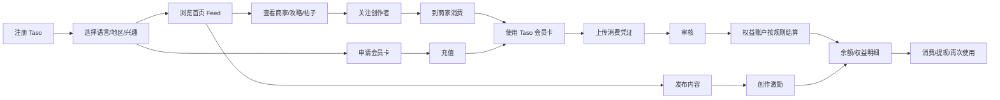

---

# 2. 产品原则

## 2.1 社交优先

首页首先服务“看内容”和“找信息”，不能让钱包、充值、报销等金融模块压过社交内容。

## 2.2 消费凭证优先

报销/权益结算必须建立在可验证消费事实之上：商户、时间、订单号、金额、支付方式、凭证图像等形成证据链。

## 2.3 钱包账务与社交账户解耦

社交余额、会员权益、可提现余额、推广佣金、创作收益必须使用独立账本字段和流水类型，不能只用一个 `balance` 字段。

## 2.4 所有收益规则可配置

将“116%、0.05%/日、16%手续费、30%/5%/1%推广奖励”等做成后台配置项，而不是写死在 App。

## 2.5 合规优先于增长

任何“收益、报销、佣金、USDT/USDC、银行卡提现”页面都必须显示规则、条件、地区限制、审核状态和风险提示，禁止用模糊文案暗示“稳赚”或“保本”。

---

# 3. 参考产品与可借鉴设计

## 3.1 X / Twitter：信息流、翻译、关注关系

X 目前支持帖子翻译：当帖子有可用翻译时，会在原文字下方提供翻译入口；X 同时区分显示语言与内容推荐语言，并允许根据用户语言偏好影响推荐内容。^1 ^2

**Taso 借鉴：**

- 原文 + “翻译成中文/日本語/English”
- 默认显示用户偏好语言
- “查看原文”随时可切换
- 单独维护“App 界面语言”和“内容偏好语言”
- 根据地区、语言、互动行为调整 Feed

## 3.2 Threads：For You + Following

Threads 已采用“为你推荐”和“关注中”两种 Feed，并支持按帖子语言与查看者语言自动翻译的机制。^3

**Taso 借鉴：**

- 推荐流：适合发现美食、旅行、商家
- 关注流：适合跟踪熟悉创作者
- 商家/地点也应成为内容实体，而非只有用户账号

## 3.3 Reddit：社区、帖子、评论、投票

Reddit 的核心机制是围绕兴趣社区进行发帖、评论、投票，让高价值内容获得更多可见性。^4

**Taso 借鉴：**

- 城市社区：Tokyo / Hong Kong / Bangkok / Seoul
- 主题社区：火锅、咖啡、烧肉、温泉、海岛等
- “有帮助”而非单纯“点赞”
- 评论区支持二级/多级回复

## 3.4 Tripadvisor：消费体验评价

Tripadvisor 的评价功能以“分享体验、帮助后来旅行者”为核心，并允许用户新增缺失地点。^5

**Taso 借鉴：**

- 每条内容可以绑定商家/地点
- 商家详情页集中呈现真实消费内容
- “我去过”与“我推荐”分开
- 评论应允许附照片/视频/人均消费/时间等结构化信息

## 3.5 Visa 联名卡

Visa 对联名卡的官方说明显示，联名卡可以由品牌与发卡机构合作提供，卡片可能是信用卡、借记卡或预付卡；Visa 也明确说明，发卡、BIN、处理等环节需要银行/发卡机构等合作伙伴参与。Visa 规则还要求联名项目由发卡机构拥有和控制，并涉及审批与责任边界。^6 ^7

**Taso 借鉴：**

App 内的“会员卡”必须设计成一个独立金融产品域，由实际发卡/支付服务商提供 API 和合规控制；Taso App 只做体验层和会员权益层。

---

# 4. 商业模式与产品闭环

## 4.1 收入来源

### A. 会员卡办理费

业务设定：**HK$1,000 / 张实体会员卡**。

产品：

- 卡片介绍
- 申请
- 身份认证（实际所需程度由合作发卡机构决定）
- 卡片费支付
- 卡片制作
- 发货
- 激活

### B. 充值手续费

业务设定：充值手续费 **16%**，产品侧必须明确展示：

```text
充值金额：HK$10,000
手续费：HK$1,600
实际支付：HK$11,600
到账权益/资金：以合作金融机构实际规则为准
```

**注意：**“16%手续费”到底属于平台服务费、支付通道费或其他费用，必须由法务/财务确认，不能在 PRD 中自行定义会计含义。

### C. 商家服务/营销

- 合作商家入驻
- 会员专属套餐
- 首页推荐
- 地区精选
- 商家活动页
- 达人合作

### D. 创作激励

创作者的收益池由平台预算或商户营销预算决定。

### E. 合规后的推广奖励

用户提出：直推 30%、二级 5%、三级 1%。

**产品设计不能直接将这组数字作为“上线即执行”的商业承诺。**

后台必须支持：

```text
佣金方案状态：Draft / Under Review / Enabled / Suspended
适用国家：...
适用用户类型：...
计佣基数：...
一级比例：...
二级比例：...
三级比例：...
结算周期：...
退款冲正：...
```

香港《禁止层压式计划条例》对以参加新成员所产生的利益作为主要诱因的金字塔计划设有禁止规定；官方说明还指出，明知相关利益主要来自介绍新参与者而诱导他人参与可能构成犯罪。^8 因此推广奖励必须由律师按实际合同、收费、商品/服务价值、计佣来源及实际运营地区审查后再决定是否使用多层级结构。

---

# 5. 核心用户角色

| Role | 权限 |
|---|---|
| Guest | 浏览公开内容、商家、登录注册 |
| Member | 发帖、关注、评论、点赞、收藏、商家消费内容 |
| Card Member | 会员卡、充值、消费、权益、账单、报销、提现 |
| Creator | 创作、创作收益、数据中心 |
| Merchant | 商户主页、优惠、订单/验证、营销 |
| Promoter | 推广链接、邀请、奖励、结算 |
| Moderator | 内容审核、投诉处理 |
| Finance | 报销、账务、提现审核 |
| Admin | 全局运营配置 |
| Compliance | KYC、AML、风险策略、规则审核 |

---

# 6. App 信息架构

```mermaid
flowchart TD
    A[Taso App]
    A --> B[首页]
    A --> C[发现]
    A --> D[发布]
    A --> E[权益]
    A --> F[我的]

    B --> B1[For You]
    B --> B2[Following]
    B --> B3[地区精选]
    B --> B4[内容卡片]

    C --> C1[搜索]
    C --> C2[地点]
    C --> C3[商家]
    C --> C4[话题]
    C --> C5[城市]

    D --> D1[文字]
    D --> D2[图片]
    D --> D3[视频]
    D --> D4[评分]
    D --> D5[绑定商家]
    D --> D6[消费凭证]

    E --> E1[会员卡]
    E --> E2[钱包]
    E --> E3[充值]
    E --> E4[消费记录]
    E --> E5[消费报销]
    E --> E6[提现]
    E --> E7[推广]
    E --> E8[创作收益]

    F --> F1[个人主页]
    F --> F2[我的帖子]
    F --> F3[收藏]
    F --> F4[关注/粉丝]
    F --> F5[设置]
    F --> F6[安全/KYC]
    F --> F7[语言/地区]
```

---

# 7. 一级导航设计

## 7.1 底部 Tab

```text
┌─────────────────────────────────────┐
│              Taso Logo              │
│                                     │
│             页面内容                 │
│                                     │
├─────────────────────────────────────┤
│ 首页   发现       ＋       权益   我的 │
└─────────────────────────────────────┘
```

### Tab 规则

| Tab | icon | 默认页 |
|---|---|---|
| 首页 | Home | For You |
| 发现 | Compass/Search | 探索 |
| + | Plus | 发布内容 |
| 权益 | Card/Wallet | 会员卡/钱包 |
| 我的 | User | 个人主页 |

发布按钮采用中间突出设计，但不能覆盖成传统“红包/赚钱”视觉语言。

---

# 8. 页面清单

## 8.1 P0 核心页面

| ID | 页面 | 优先级 |
|---|---|---|
| P001 | 启动页 | P0 |
| P002 | 欢迎/语言/地区 | P0 |
| P003 | 登录/注册 | P0 |
| P004 | 兴趣选择 | P0 |
| P101 | 首页-For You | P0 |
| P102 | 首页-Following | P0 |
| P103 | 帖子详情 | P0 |
| P104 | 评论区 | P0 |
| P105 | 用户主页 | P0 |
| P201 | 发现首页 | P0 |
| P202 | 搜索结果 | P0 |
| P203 | 商家详情 | P0 |
| P204 | 地点详情 | P0 |
| P301 | 发布文字/图片 | P0 |
| P302 | 发布视频 | P0 |
| P303 | 商家打卡/评分 | P0 |
| P401 | 会员卡首页 | P0 |
| P402 | 申请实体卡 | P0 |
| P403 | 卡片详情 | P0 |
| P404 | 充值 | P0 |
| P405 | 钱包 | P0 |
| P406 | 交易明细 | P0 |
| P407 | 消费报销 | P0 |
| P408 | 报销详情 | P0 |
| P409 | 提现 | P0 |
| P410 | 推广中心 | P0* |
| P411 | 创作收益 | P0 |
| P501 | 我的 | P0 |
| P502 | 设置 | P0 |
| P503 | 语言与地区 | P0 |
| P504 | 通知中心 | P1 |
| P505 | 安全与隐私 | P0 |
| P506 | 实名/KYC 状态 | P0 |

---

# 9. P001 启动页

## UI

```text
┌────────────────────────┐
│                        │
│                        │
│        TASO            │
│       特  搜           │
│                        │
│   Explore · Share · Go │
│                        │
│                        │
│        加载中…         │
│                        │
└────────────────────────┘
```

### 行为

- 冷启动检查版本
- 检查地区
- 检查登录态
- 检查维护公告
- 检查风控状态
- 拉取语言包
- 拉取 Feed 配置

### 异常

网络失败 → 显示“离线重试”；
版本过低 → 强制升级；
服务维护 → 展示公告页。

---

# 10. P002 欢迎 / 语言 / 地区

## 核心目标

第一次打开就确定：

1. App 显示语言
2. 内容推荐语言
3. 所在国家/地区
4. 兴趣

## UI

```text
┌────────────────────────┐
│ Skip                   │
│                        │
│  Welcome to Taso       │
│  发现世界的每一次体验   │
│                        │
│  App Language           │
│  [ 简体中文        ▾ ] │
│                        │
│  Content Languages      │
│  ☑ 中文  ☑ English     │
│  ☐ 日本語 ☐ 한국어      │
│                        │
│  Region                 │
│  [ Hong Kong      ▾ ]  │
│                        │
│  [        开始探索      ]│
└────────────────────────┘
```

## 规则

语言分为：

- `ui_language`
- `content_languages`
- `translation_target_language`
- `region`

不要将它们合并成一个字段。

---

# 11. P003 注册 / 登录

## 登录方式

- 手机号
- Email
- Apple
- Google
- 可选第三方 OAuth

## 交互

输入手机号 → 获取验证码 → 验证 → 创建账号。

首次注册：

```text
语言 → 地区 → 兴趣 → 推荐创作者 → 首页
```

## 风控

- 同设备批量注册检测
- 验证码频率限制
- IP 风险
- 设备指纹
- 黑名单

---

# 12. P101 首页 For You

## 目标

打造“打开 App 就能刷”的消费内容 Feed。

## UI 原型

```text
┌─────────────────────────────────────┐
│ Taso       For You | Following   🔍 │
├─────────────────────────────────────┤
│ @tokyofood · 2h ago                 │
│ Shibuya这家烧肉真的值得来吗？         │
│                                     │
│ ┌─────────────────────────────────┐ │
│ │            图片/视频              │ │
│ │                                 │ │
│ └─────────────────────────────────┘ │
│                                     │
│ 📍 Shibuya · 焼肉Taso               │
│ ¥3,800 / 人 · ★4.7                  │
│                                     │
│ ❤️ 1.2K   💬 82   ↗ 分享   🔖 收藏    │
│                                     │
│ 查看翻译 · View original             │
├─────────────────────────────────────┤
│     Home  Explore  +  Benefits Me   │
└─────────────────────────────────────┘
```

## 帖子类型

### 普通社交帖

文字 + 图/视频。

### 消费体验帖

增加：

- 商家
- 地点
- 消费金额
- 人均
- 消费时间
- 评分
- 推荐指数

### 攻略帖

可包含多个地点。

### 旅行日志

时间轴形式。

---

# 13. Feed 推荐机制

## 推荐信号

```text
基础分
+ 兴趣匹配
+ 语言匹配
+ 地理位置
+ 用户关注
+ 内容质量
+ 新鲜度
+ 评论质量
+ 商家相关性
+ 消费真实性
- 举报
- 重复内容
- 广告疲劳
- 风险账号
```

## 内容池

```text
Following Pool
Recommended Pool
Local Pool
Trending Pool
Merchant Pool
Creator Pool
```

## 冷启动

新用户没有行为时：

```text
地区 40%
兴趣 30%
热门 20%
语言 10%
```

后续随着行为数据逐步切换到个性化推荐。

---

# 14. P102 Following

严格展示关注对象内容。

顶部：

```text
For You | Following
```

长按 Feed 卡片：

- 不感兴趣
- 屏蔽该账号
- 屏蔽该商家
- 举报
- 分享

---

# 15. P103 帖子详情

## 页面结构

```text
作者
 ↓
原文
 ↓
翻译
 ↓
图片/视频
 ↓
商家/地点卡
 ↓
互动
 ↓
评论
 ↓
相关推荐
```

## 翻译

默认：

```text
原文：This ramen is surprisingly good.
[翻译成中文]
```

点击后：

```text
原文
This ramen is surprisingly good.

中文
这家拉面出乎意料地好吃。

[查看原文]
```

翻译服务需要保留原文，不修改原帖子内容。X 的官方产品设计就是在原文下方提供翻译，而非直接覆盖原文。^1

---

# 16. P104 评论区

## UI

```text
评论 82

@alex
这里排队多久？
  ↳ @tom：大概30分钟
  ❤️ 23    回复

@mia
人均大概多少？
  ↳ 作者：3800日元
```

## 排序

- 热门
- 最新
- 作者回复

## 评论功能

- 点赞
- 回复
- 翻译
- 举报
- 引用

---

# 17. P105 用户主页

```text
┌─────────────────────────────┐
│ ←                 ⋯         │
│                             │
│         [Avatar]            │
│       Alex · Tokyo          │
│       Creator               │
│                             │
│  12.8K Followers  1,243     │
│                             │
│ [关注]                      │
│                             │
│ Posts | Reviews | Media     │
│                             │
│ 图片网格 / 内容列表          │
└─────────────────────────────┘
```

用户可以被定义为：

- 普通会员
- Creator
- Merchant
- Official

认证徽章必须和身份类别绑定。

---

# 18. P201 发现首页

## 核心模块

```text
搜索框

附近
城市
美食
旅行
热门
商家优惠

[Tokyo]
[Hong Kong]
[Bangkok]
[Seoul]

今日热门

大家都在搜：
拉面 / 烧肉 / 酒店 / 温泉
```

## Discovery 推荐

按地区生成：

```text
距离 + 热度 + 用户兴趣 + 商家质量 + 内容新鲜度
```

---

# 19. P202 搜索

搜索支持：

- 用户
- 帖子
- 商家
- 地点
- 话题
- 城市

## 搜索结果 Tab

```text
全部 | 用户 | 商家 | 帖子 | 地点 | 话题
```

## 搜索建议

支持多语言联想：

```text
拉面
ramen
ラーメン
```

可统一召回。

---

# 20. P203 商家详情

这是 Taso 与普通 Twitter 类产品最核心的差异页面。

```text
┌──────────────────────────────┐
│ 图片轮播                      │
│                              │
│ 焼肉Taso                     │
│ ★4.7  2,381 reviews          │
│ 📍 Tokyo Shibuya             │
│                              │
│ [导航] [收藏] [分享]          │
│                              │
│ Taso Card Benefit             │
│ 会员专享：95折 + 饮品1杯      │
│                              │
│ 今日营业 11:00 - 23:00        │
│                              │
│ Posts | Reviews | Offers      │
│                              │
│ [合作商家]                    │
└──────────────────────────────┘
```

## 商家详情数据

- Logo
- 封面
- 商家名
- 多语言名
- 地址
- 经纬度
- 营业时间
- 电话
- 类目
- 评分
- 评论数
- Taso 会员权益
- 是否合作商家
- 优惠有效期
- 用户内容

---

# 21. P204 地点详情

与商家解耦。

例：

```text
Shibuya

热度 98

热门内容
热门商家
附近活动
附近创作者
```

地点本身也可以成为社交对象。

---

# 22. P301 发布文字 / 图片

## 发布流程

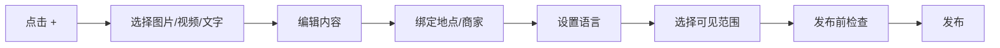

## 编辑器

```text
┌────────────────────────────┐
│ 取消             发布       │
│                            │
│ 今天去了一家很不错的烧肉店… │
│                            │
│ [图片] [图片] [+]          │
│                            │
│ 📍 添加地点                 │
│ 🏪 添加商家                 │
│ ⭐ 添加评分                 │
│ 💴 添加消费金额             │
│                            │
│ 谁可以看：所有人 ▾          │
└────────────────────────────┘
```

## 自动能力

- AI 推荐话题
- 自动识别商家
- OCR 可选识别消费金额
- 图片质量检测
- NSFW 检测
- 烟火、暴力、广告等内容审核
- 自动生成翻译

---

# 23. P303 消费体验发布

这是平台“社交 + 商业”的重要差异化入口。

## 表单

```text
商家：焼肉Taso
地点：Shibuya
消费时间：2026-09-08 19:30
人均：¥3,800
评分：★★★★☆
推荐：值得

体验：
________________________________

照片/视频
[+] [image]

是否使用 Taso 会员卡：
[✓] 是

消费凭证：
[上传，可选]

[发布体验]
```

如果后续涉及报销资格，应在该页面明确：

> “发布内容 ≠ 自动获得报销；报销必须另行提交符合要求的消费凭证并完成审核。”

---

# 24. P401 会员卡首页

## 定位

“权益中心”而非“钱包中心”。

```text
┌────────────────────────────┐
│ 我的会员卡           设置   │
│                            │
│ ┌────────────────────────┐ │
│ │        TASO CARD       │ │
│ │                        │ │
│ │ **** **** **** 3812    │ │
│ │ VISA                   │ │
│ └────────────────────────┘ │
│                            │
│ 可用余额                    │
│ HK$ 12,580.00              │
│                            │
│ [充值]   [消费记录]         │
│                            │
│ 本月权益                    │
│ 优惠 HK$ 382               │
│ 待结算 HK$ 96              │
│                            │
│ ───────────────────────── │
│ 报销中心                    │
│ 推广中心                    │
│ 创作收益                    │
└────────────────────────────┘
```

## 重要状态

- Card Applying
- Card Pending Verification
- Card Issued
- Card Shipping
- Card Active
- Card Frozen
- Card Expired

---

# 25. P402 申请实体会员卡

## 页面

```text
Taso Visa 联名会员卡

实体卡办理费
HK$ 1,000

会员权益
✓ 合作商家优惠
✓ 会员活动
✓ 消费权益
✓ 全球支付能力（以发卡机构支持范围为准）

[立即申请]
```

## Step

```text
产品说明
→ 条款同意
→ 身份验证
→ 地址信息
→ 申请支付
→ 审核
→ 制卡
→ 配送
→ 激活
```

不要在 Taso App 内保存完整卡号、CVV 等高敏感支付数据；优先使用发卡机构 Tokenization/SDK/API。

---

# 26. P403 卡片详情

```text
卡状态：已激活

额度/余额：HK$ 12,580

本月消费：HK$ 3,920

合作商家节省：HK$ 280

[冻结卡片]
[设置交易通知]
[查看完整卡号*]
[更换/补卡]
```

*完整卡信息仅由符合 PCI DSS 与发卡行安全规范的卡组件提供。

---

# 27. P404 充值

## 页面

```text
充值

选择币种
[HKD] [USD] [USDT] [USDC]

充值金额
[ 10,000.00 ]

费用
充值金额         HK$10,000
手续费 16%        HK$1,600
预计支付          HK$11,600

到账规则：以实际合作机构处理结果为准

[确认充值]
```

## USDT / USDC

必须增加：

```text
Network
○ ERC-20
○ TRC-20
○ Solana
...

钱包地址
[***************]

[复制地址]

风险提示
发送至错误网络可能导致资产无法追回。
```

香港自 2025 年 8 月 1 日起实施稳定币发行人监管制度；HKMA 亦说明稳定币业务受到客户保护、反洗钱、金融稳定等监管关注。2026 年 5 月 SFC/HKMA 又针对“持牌稳定币发行人发行的相关稳定币”的相关活动发布了进一步要求。因此，Taso 不应简单地把“支持 USDT/USDC 充值”当成普通支付功能，应通过持牌合作方完成钱包、托管、兑换、合规筛查及链上风控。^9 ^10 ^11

---

# 28. P405 钱包

## 余额必须拆账

```text
可用消费余额         HK$ 10,500
创作收益             HK$ 620
推广奖励             HK$ 180
待结算报销           HK$ 1,240
冻结金额             HK$ 300
可提现余额            HK$ 800
```

禁止显示一个笼统“总余额”让用户误以为所有余额均可立即提现。

## 余额状态

- Available
- Pending
- Frozen
- Locked
- Withdrawable
- Reversed

---

# 29. P406 交易明细

筛选：

```text
全部 | 充值 | 消费 | 报销 | 创作 | 推广 | 提现 | 手续费
```

每条流水：

```text
2026-09-08
会员卡充值
+HK$10,000
手续费 HK$1,600
交易完成
```

必须支持交易 ID、时间、币种、金额、状态、关联单号。

---

# 30. P407 消费报销

## 首页

```text
消费报销

可提交单据
已审核 12 张
结算中 8 张
已完成 21 张

[+ 提交消费账单]

结算中

餐厅 A
消费：HK$ 800
可结算上限：HK$ 928
已结算：HK$ 120
剩余：HK$ 808
日结规则：按平台公布规则执行

[查看详情]
```

## 核心规则

用户提出：

- 最高报销比例：116%
- 每日结算：0.05%
- 每张账单独立结算
- 余额可提现至数字钱包或绑定银行卡

产品必须将它拆成四个可配置字段：

```text
eligible_ratio = 116%
daily_settlement_rate = 0.05%
settlement_base = original_eligible_amount
max_settlement = original_eligible_amount * 116%
```

若 `daily_settlement_rate = 0.05%` 且按原始合规金额每日线性结算，则达到 116% 总额理论上需要：

`116% / 0.05% = 2320 天 ≈ 6.36 年`

因此如果商业上希望用户在明显更短时间内完成结算，必须增加其他合法机制（例如不同档位、活动加速、非线性计算或更改比例），不能在交互上隐藏这一时间跨度。

同时，**不建议页面使用“收益”“投资回报”“稳赚”等措辞**。应根据实际法律结构使用“消费权益结算”“平台补贴”“会员权益”等经法务确认后的定义。

---

# 31. P408 报销详情

## 页面

```text
消费报销 #R202609081288

商家：焼肉Taso
消费日期：2026-09-08
原始消费：HK$800
审核金额：HK$800
权益上限：HK$928

结算进度
████████░░  62%

已结算：HK$120
今日预计：HK$0.40
剩余：HK$808

结算记录
09/09  HK$0.40  已入账
09/08  HK$0.40  已入账
...

[查看原始凭证]
```

## 状态

```text
DRAFT
SUBMITTED
UNDER_REVIEW
APPROVED
REJECTED
SETTLING
COMPLETED
FROZEN
REVERSED
```

审核失败必须明确原因：

- 凭证模糊
- 商家不符合资格
- 金额不一致
- 重复提交
- 超过时限
- 风控命中
- 非本人消费
- 其他

---

# 32. P409 提现

## 首页

```text
提现

可提现余额：HK$ 800

提现至
○ 绑定银行卡
○ 数字钱包

金额
[ 500 ]

手续费
HK$ X

到账时间
预计 X 个工作日

[提交提现]
```

## 风控

- 首次提现需要实名/加强验证
- 新绑定银行卡冷却期
- 高金额人工审核
- 黑名单钱包地址拦截
- AML 风险筛查
- 资金来源/单据关联

数字资产提现只能在实际持牌/合规的支付或虚拟资产合作架构下开放。

---

# 33. P410 推广中心

## 页面

```text
推广中心

我的邀请人数      128
直接邀请           32
总奖励          HK$ 2,380
待结算             HK$ 420

我的推广链接
https://taso.app/r/A8K29
[复制] [分享]

奖励结构（仅展示当前适用规则）
一级     xx%
二级     xx%
三级     xx%

[查看详细规则]
```

产品设计原则：**奖励规则以后台审核通过的地区/方案为准，不直接在客户端硬编码 30% / 5% / 1%。**

## 推荐关系树

```text
我
├── A
│   ├── A1
│   └── A2
├── B
│   ├── B1
│   └── B2
└── C
```

前台只展示合法、必要的信息，不展示完整层级用户的隐私数据。

---

# 34. P411 创作收益

```text
创作中心

本月内容收益        HK$ 620
待结算               HK$ 180
已结算             HK$ 440

内容表现
帖子 1   124K views   收益 HK$ 120
帖子 2    62K views   收益 HK$ 80
帖子 3    18K views   收益 HK$ 23

[收益规则]
```

## 创作收益模型建议

第一阶段不要按“曝光=固定现金”简单发钱。建议：

```text
有效曝光
+ 阅读完成率
+ 收藏
+ 评论质量
+ 真实消费带来的商户价值
+ 内容原创性
- 刷量
- 互刷
- 垃圾内容
```

形成“创作质量分”。

---

# 35. P501 我的

```text
┌────────────────────────────┐
│ 设置                         │
│                             │
│ [Avatar] Alex                │
│ Creator · Tokyo              │
│                             │
│ 12.8K Followers              │
│                             │
│ Posts     Reviews    Likes   │
│                             │
│ ──────────────────────────  │
│ 我的帖子                     │
│ 我的收藏                     │
│ 我的关注                     │
│ 我的足迹                     │
│ 创作中心                     │
│ 会员卡                       │
│ 钱包                         │
│ 消费报销                     │
│ 推广中心                     │
│ 设置                         │
└────────────────────────────┘
```

---

# 36. P503 语言与地区

## 设置页面

```text
语言与地区

App 显示语言
中文（简体）

内容语言
✓ 中文
✓ English
✓ 日本語

自动翻译
[ON]

自动翻译到
中文

显示地区
Hong Kong

本地内容优先级
[高]
```

## 自动翻译策略

每条内容：

```text
language_detected
↓
user_content_languages
↓
translation_target_language
↓
是否已有缓存
↓
机器翻译
↓
翻译质量/敏感词检测
↓
展示
```

支持：

- 原文
- 自动翻译
- 查看原文
- 纠正翻译

---

# 37. P505 安全与隐私

模块：

- 登录设备
- 修改密码
- 2FA
- 手机/邮箱
- 提现安全
- 钱包地址管理
- 银行卡管理
- 授权管理
- 隐私设置
- 拉黑/屏蔽
- 下载个人数据
- 注销账户

金融相关操作建议强制启用 2FA。

---

# 38. P506 实名/KYC 状态

```text
身份验证

当前状态：已通过

姓名：******
地区：Hong Kong

可用功能
✓ 会员卡
✓ 充值
✓ 报销
✓ 提现
✓ 数字资产
```

状态：

```text
NOT_STARTED
PENDING
VERIFIED
REJECTED
EXPIRED
REVIEW_REQUIRED
```

KYC 所需字段由实际牌照方/发卡行/支付机构决定，Taso 不应凭产品设计自行扩大个人敏感资料收集范围。

---

# 39. 关键交互 01：用户发帖

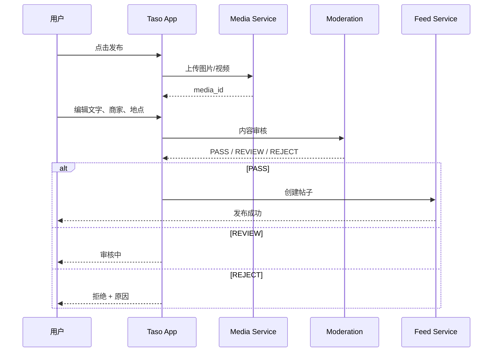

---

# 40. 关键交互 02：消费账单报销

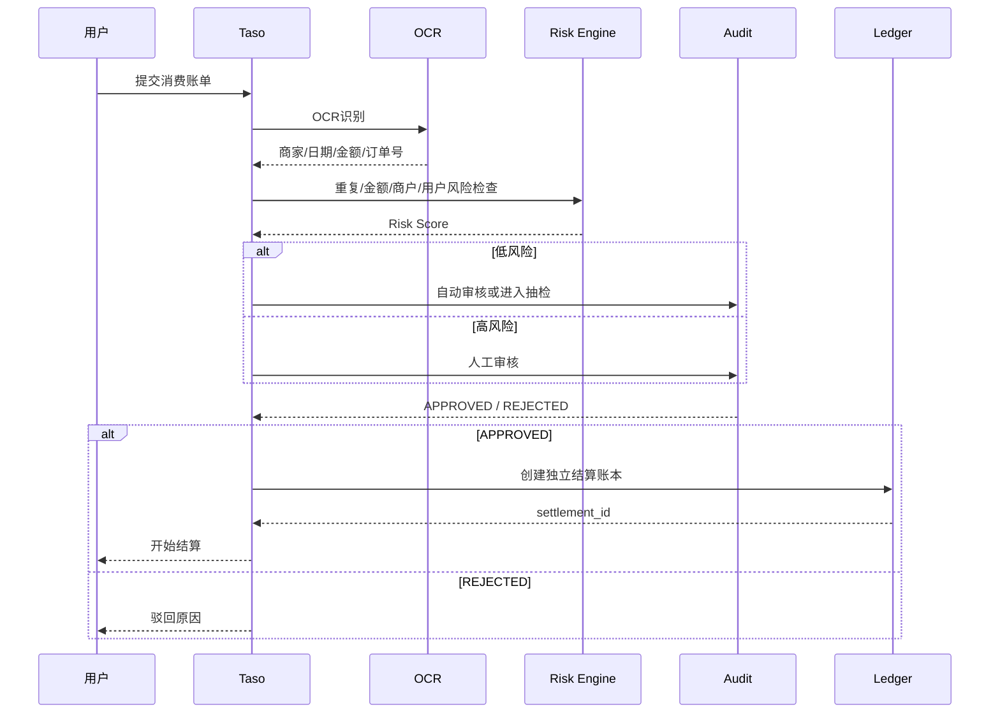

---

# 41. 关键交互 03：会员卡充值

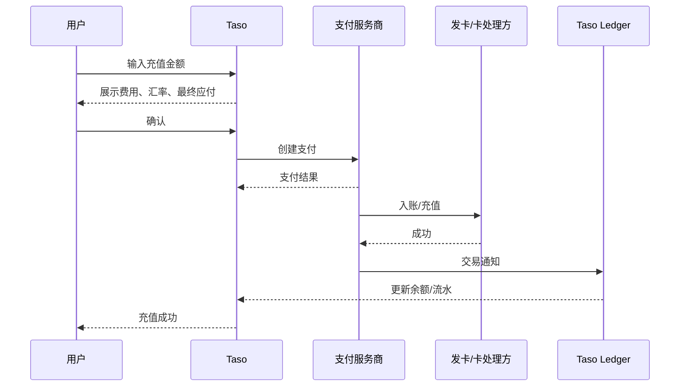

---

# 42. 关键交互 04：USDT/USDC 充值

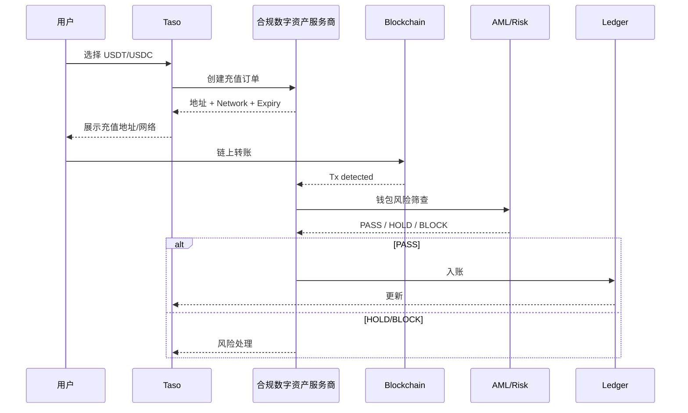

---

# 43. 商家系统

虽然主要是消费者 App，但商家生态必须同时建设。

## Merchant Portal

### 商家首页

- 今日会员消费
- 今日订单
- 会员权益使用
- 用户评价
- 内容曝光
- 核销
- 活动

### 商家详情管理

- 基础信息
- 门店
- 营业时间
- 菜单/商品
- 地图
- 多语言
- 会员权益

### 优惠创建

```text
活动名称
优惠类型
折扣
开始时间
结束时间
适用门店
适用会员等级
每日上限
```

### 商家核销

用户出示：

```text
Taso Membership QR
```

商家扫码后：

```text
会员身份
优惠规则
订单金额
优惠金额
最终金额
```

---

# 44. 后台运营系统

## Dashboard

```text
DAU
MAU
注册用户
活跃创作者
内容发布量
商家数
会员卡数
充值金额
消费金额
报销申请
报销待结算
提现申请
推广奖励
风险订单
```

## 内容后台

- 内容审核
- 举报
- 用户申诉
- 敏感词
- AI 审核
- 人工审核
- 商家投诉

## 商家后台

- 商户审核
- 门店管理
- 优惠管理
- 商家结算
- 用户评论

## 金融/账务后台

- 充值
- 手续费
- 消费
- 报销
- 创作收益
- 推广佣金
- 提现
- 冲正
- 冻结

## 风控后台

- 用户风险
- 设备风险
- IP 风险
- 钱包风险
- 重复凭证
- 多账号关联
- 异常推广
- 异常提现

---

# 45. 核心数据模型

## User

```text
id
username
nickname
avatar
country_code
region
ui_language
content_languages
translation_language
email
phone
status
kyc_status
creator_status
merchant_status
risk_level
created_at
```

## Post

```text
id
author_id
post_type
text
language
visibility
location_id
merchant_id
consumption_id
like_count
comment_count
share_count
bookmark_count
status
created_at
```

## Merchant

```text
id
name
localized_names
category
address
country
city
lat
lng
business_hours
rating
review_count
partner_status
```

## Card

```text
id
user_id
issuer_id
card_product_id
masked_pan
status
activated_at
expiry_at
```

## WalletAccount

```text
id
user_id
currency
account_type
available_balance
pending_balance
locked_balance
withdrawable_balance
status
```

## Transaction

```text
id
user_id
account_id
type
sub_type
currency
amount
fee
net_amount
source_id
status
created_at
```

## Reimbursement

```text
id
user_id
merchant_id
consumption_time
original_amount
approved_amount
eligible_ratio
max_settlement_amount
settlement_rate
settled_amount
remaining_amount
status
risk_score
review_reason
```

## Referral

```text
id
user_id
parent_user_id
level
commission_plan_id
commission_rate
commission_base
commission_amount
status
```

## Translation

```text
id
content_id
source_language
target_language
source_text
translated_text
engine
quality_score
status
```

---

# 46. 账务设计原则

**不要使用“改余额”的方式实现业务账务。**

采用复式或准复式 Ledger 思路：

```text
Transaction
   ↓
Ledger Entry
   ↓
Account Balance Projection
```

所有钱/权益都有来源：

```text
TOPUP
CARD_PAYMENT
REIMBURSEMENT_SETTLEMENT
CREATOR_REWARD
REFERRAL_REWARD
WITHDRAWAL
FEE
REVERSAL
FREEZE
UNFREEZE
```

### 幂等

任何支付/报销/提现接口必须使用：

```text
idempotency_key
```

避免重复入账。

---

# 47. 报销风控规则

建议 V1 即加入：

### 47.1 重复凭证

图片 Hash + OCR 字段 + 用户 + 商家 + 日期联合判断。

### 47.2 金额篡改

OCR 金额与用户填写金额不一致 → 人工审核。

### 47.3 商家真实性

商家必须存在于 Taso Merchant Master 或可验证交易来源。

### 47.4 频率异常

```text
同用户
24小时提交 50 单
→ Risk High
```

### 47.5 多账户关联

同设备 / 同支付来源 / 同钱包 / 同收款账户关联。

### 47.6 时间异常

消费时间与票据时间不一致。

---

# 48. UI 设计系统

## 48.1 视觉方向

关键词：

**Premium / Travel / Editorial / Social / Fintech-lite**

不建议使用典型“金融理财 App”视觉。

## 48.2 色彩

```text
Primary       #111111
Background    #F7F7F5
Card          #FFFFFF
Text          #111111
Secondary     #666666
Divider       #E8E8E8
Success       #16803C
Warning       #B7791F
Danger        #C53030
Accent        #C8A96B
```

品牌金建议只作为会员卡、权益、认证等少量强调，不要满屏金色。

## 48.3 字体

中文：Noto Sans CJK / PingFang SC

英文：Inter / SF Pro

日文：Noto Sans JP

## 48.4 圆角

```text
Button     12px
Card       16px
Avatar     50%
Input      12px
BottomSheet 20px
```

## 48.5 间距

采用 4pt Grid：

```text
4 / 8 / 12 / 16 / 20 / 24 / 32 / 40
```

---

# 49. 首页 UI 建议

首页整体视觉建议接近：

```text
X 的文本信息密度
+
Instagram 的图片表达
+
TikTok 的沉浸式视频
+
Tripadvisor 的消费信息
+
Taso 自己的商家/权益卡片
```

### 关键组件

1. Post Card
2. Media Carousel
3. Merchant Mini Card
4. Location Chip
5. Translation Row
6. Social Action Bar
7. Offer Card
8. Creator Badge
9. Consumption Badge

---

# 50. 内容可信度设计

这是 Taso 与普通社交平台差异最大的地方之一。

建议提供：

### 用户标签

```text
✓ Verified Member
✓ Verified Purchase
✓ Local Creator
✓ Frequent Traveler
```

其中“Verified Purchase”只能在平台或可信数据源验证消费后展示。

例如：

```text
Alex · Tokyo
✓ Verified Purchase

这家寿司值得去吗？
```

比单纯显示“达人”更有说服力。

---

# 51. 内容商业化

创作者可以：

```text
普通帖子
↓
高质量内容
↓
商家合作
↓
品牌合作
↓
创作激励
```

商家推广内容必须有明确广告/合作标识，例如：

```text
Sponsored
合作内容
```

避免把商业推广伪装成普通用户真实体验。

---

# 52. 通知中心

通知分类：

```text
全部
互动
关注
订单/权益
审核
系统
```

### 示例

```text
❤️ Alex liked your post

🏪 Taso 消费凭证审核已通过

💰 今日消费权益 HK$0.40 已入账

💳 会员卡充值 HK$10,000 已成功

🌏 Your post has been translated into Japanese
```

---

# 53. 举报 / 内容安全

举报原因：

```text
垃圾广告
诈骗
虚假消费
虚假评价
色情
暴力
仇恨
盗用内容
冒充
其他
```

高风险金融内容额外增加：

```text
虚假收益承诺
投资诈骗
虚假提现
虚假充值
诱导转账
```

---

# 54. 多语言产品架构

## 支持语言

V1 建议：

- 简体中文
- 繁体中文
- English
- 日本語
- 한국어

V2：

- Thai
- Spanish
- French
- Indonesian
- Vietnamese

## Translation Cache

同一帖子对同一语言只翻译一次：

```text
content_id + target_language + content_version
```

避免重复调用翻译服务。

---

# 55. 地区化

地区不是只有 IP。

建议综合：

```text
用户手动设置
+
设备系统地区
+
GPS（用户授权）
+
IP 粗粒度地区
+
消费地点
```

对于金融/卡功能，地区判断必须使用合规定义，而不是单纯 IP 判断。

---

# 56. 首页 Feed Ranking V1

推荐分可设计为：

```text
score =
  0.25 * interest_match
+ 0.15 * social_affinity
+ 0.15 * local_relevance
+ 0.15 * content_quality
+ 0.10 * freshness
+ 0.10 * merchant_relevance
+ 0.10 * creator_quality
```

V2 加入：

- watch time
- completion rate
- save probability
- follow probability
- conversion

模型不直接使用“消费金额”决定曝光，避免把平台内容生态异化为“花钱越多越容易获得流量”。

---

# 57. 推荐系统事件

App 埋点：

```text
feed_impression
post_open
post_like
post_comment
post_share
post_save
post_follow
post_not_interested
translation_open
merchant_open
merchant_save
direction_click
card_view
card_apply
card_topup
card_payment
reimbursement_submit
reimbursement_approve
withdraw_submit
```

---

# 58. MVP 范围

## Phase 1：社交内容

必须上线：

- 注册登录
- 多语言
- Feed
- Following
- 发帖
- 图片/视频
- 评论
- 点赞
- 收藏
- 分享
- 用户主页
- 搜索
- 商家
- 地点
- 自动翻译

## Phase 2：会员权益

- 会员卡
- 申请卡
- 卡片状态
- 充值
- 消费记录
- 商家优惠

## Phase 3：资金/权益

- 消费凭证
- 报销
- 结算
- 提现
- 风控

## Phase 4：增长

- Creator Economy
- Referral
- 商户营销
- 活动中心

## Phase 5：数字资产

- USDT
- USDC
- 网络选择
- 地址管理
- 链上确认
- AML 风险

数字资产应放在独立合规项目中，不建议为了“功能完整”与社交 MVP 同批上线。

---

# 59. 核心用户故事

## US-001 浏览

作为用户，我希望根据我的地区和语言看到适合我的美食/旅行内容。

## US-002 分享

作为会员，我希望上传图片和视频分享我的消费体验。

## US-003 翻译

作为日本用户，我希望阅读中文用户发布的内容，并能够自动翻译成日语。

## US-004 找商家

作为游客，我希望通过真实用户内容找到附近值得去的餐厅。

## US-005 会员卡

作为会员，我希望在合作商家消费时享受专属优惠。

## US-006 账单

作为会员，我希望上传合格的消费凭证申请相应的平台权益结算。

## US-007 提现

作为有可提现余额的用户，我希望查看手续费和到账时间，再决定是否提现。

## US-008 创作者

作为创作者，我希望了解内容产生了多少有效互动和创作收益。

## US-009 商家

作为商家，我希望知道我的门店获得了多少曝光、会员消费和内容推荐。

---

# 60. 关键状态机

## 报销状态机

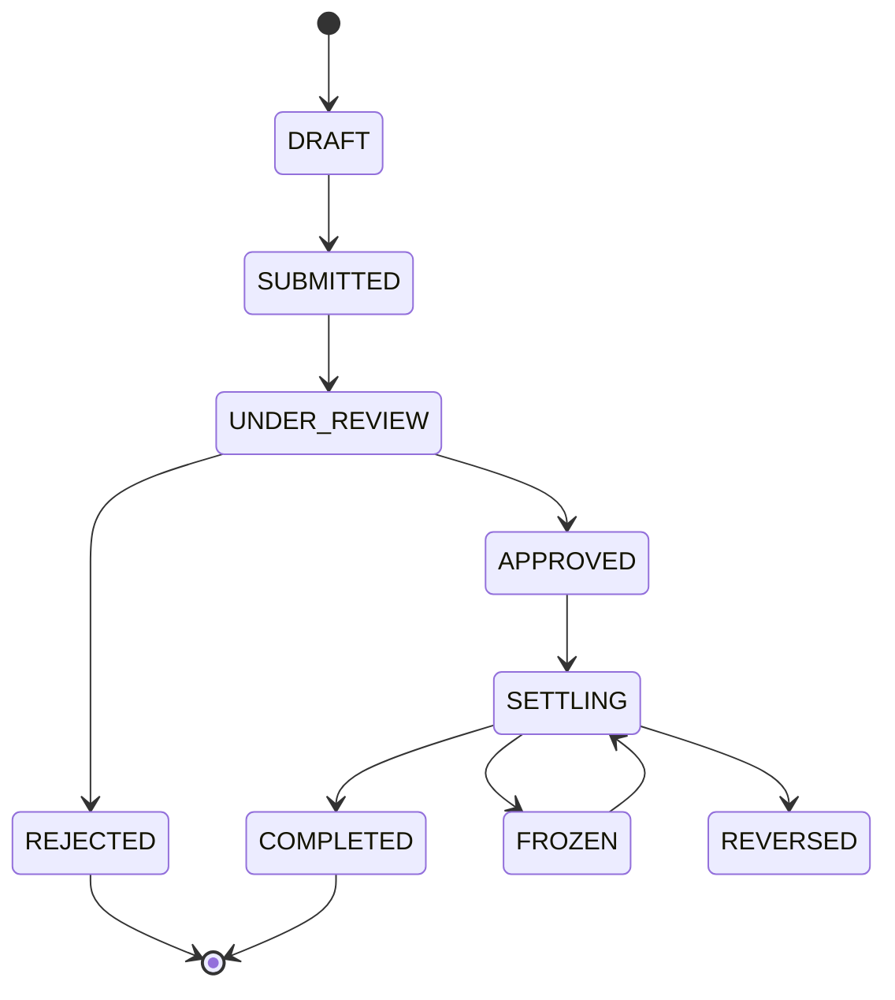

## 会员卡状态机

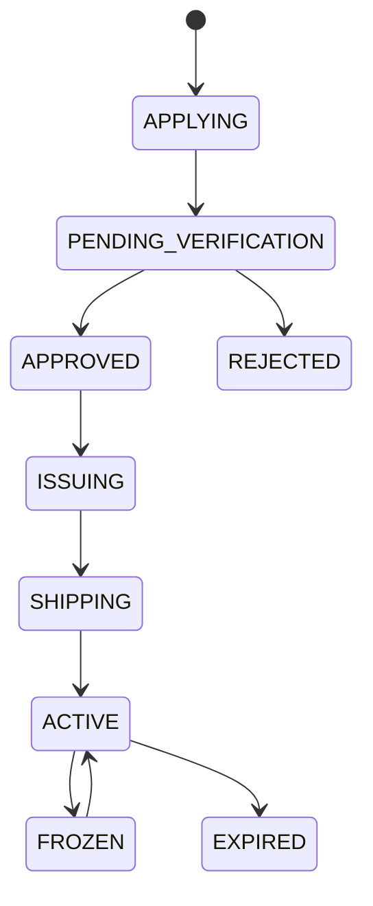

---

# 61. API 模块建议

## Auth

```text
POST /api/v1/auth/register
POST /api/v1/auth/login
POST /api/v1/auth/otp
POST /api/v1/auth/logout
```

## Feed

```text
GET /api/v1/feed/for-you
GET /api/v1/feed/following
POST /api/v1/posts
GET /api/v1/posts/{id}
POST /api/v1/posts/{id}/like
POST /api/v1/posts/{id}/bookmark
```

## Translation

```text
GET /api/v1/posts/{id}/translations
POST /api/v1/translations
```

## Merchant

```text
GET /api/v1/merchants
GET /api/v1/merchants/{id}
GET /api/v1/merchants/{id}/offers
```

## Card

```text
POST /api/v1/cards/application
GET /api/v1/cards
GET /api/v1/cards/{id}
POST /api/v1/cards/{id}/freeze
POST /api/v1/cards/{id}/activate
```

## Wallet

```text
GET /api/v1/wallets
GET /api/v1/wallets/{currency}
GET /api/v1/transactions
POST /api/v1/topups
```

## Reimbursement

```text
POST /api/v1/reimbursements
GET /api/v1/reimbursements
GET /api/v1/reimbursements/{id}
```

## Withdrawal

```text
POST /api/v1/withdrawals
GET /api/v1/withdrawals
```

## Referral

```text
GET /api/v1/referral/summary
GET /api/v1/referral/tree
GET /api/v1/referral/transactions
```

---

# 62. 技术架构建议

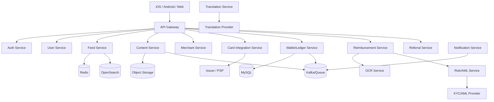

---

# 63. 非功能需求

## 性能

| 场景 | SLA |
|---|---|
| 首页首屏 | P95 < 1.5s |
| Feed 翻页 | P95 < 800ms |
| 帖子详情 | P95 < 1.2s |
| 搜索 | P95 < 800ms |
| 钱包余额 | P95 < 700ms |
| 交易明细 | P95 < 1s |

## 可用性

核心社交：99.9%

资金/钱包：建议 > 99.95%，并有降级策略。

## 安全

- TLS
- OAuth 2.0 / OIDC
- JWT + Refresh Token
- 2FA
- Device binding
- Rate Limit
- WAF
- Anti-bot
- Audit Log
- 数据加密
- 敏感字段脱敏

---

# 64. 财务与风控必须独立设计

建议系统存在三个域：

```text
Social Domain
   ↓
Membership Domain
   ↓
Financial Domain
```

而不是：

```text
User.balance = xxx
```

金融数据应当以不可变流水为主，余额是投影值。

### 对账

至少需要：

- Taso Ledger
- PSP
- Issuer
- Bank
- Crypto Provider

五方日终对账。

---

# 65. 合规架构重点

## 65.1 Visa / 卡

Visa 官方资料表明，要启动卡项目通常需要银行关系、Issuer Processor，并可能需要 Program Manager；BIN Sponsor 通常是持有 BIN 的发卡机构，负责资金、风险及当地法规等。Visa 的联名卡规则也要求 issuer 对项目拥有和控制相应责任。^6 ^7

**设计结论：**

Taso 不应在自己的后端“模拟发卡”，而应接入：

```text
Issuer / BIN Sponsor
        ↓
Issuer Processor
        ↓
Card API / SDK
        ↓
Taso App
```

## 65.2 储值/钱包

HKMA 说明，储值工具（包括电子钱包和预付卡等）受储值支付工具监管框架管理；香港亦存在 SVF 牌照制度。^12 ^13

**设计结论：**

“用户充值 → 平台余额 → 用于消费/支付/提现”不能仅根据互联网 App 的普通账户逻辑实现，要先确定业务究竟落入何种支付/储值安排。

## 65.3 数字资产

HKMA 说明香港稳定币发行人监管制度于 2025 年 8 月 1 日生效；2026 年相关监管文件进一步涉及持牌稳定币发行人相关稳定币活动及数字资产托管等安排。^9 ^10 ^11

**设计结论：**

USDT/USDC 功能建议采用：

```text
Taso
 ↓
Licensed / compliant crypto service provider
 ↓
Wallet / custody / conversion / screening
```

而不是自己管理用户私钥。

## 65.4 推广分佣

多级分佣功能的产品风险不只来自支付，还可能涉及消费者保护、营销和禁止层压式计划等问题。香港政府对 Cap. 617 的官方解释特别强调“参加新成员所产生的利益”这一诱因结构。^8

因此 PRD 采用：

> **Referral Plan Engine**

而不是硬编码“三级返佣系统”。

---

# 66. 产品文案建议

## 品牌主标题

> **Taso 特搜｜发现真实的世界。**

## App 首页

> 今天，去哪里？

## 商家

> 真实用户，真实体验。

## 会员卡

> 一张卡，连接更多本地权益。

## 消费内容

> 吃过、玩过、住过，再分享。

## 创作者

> 让每一次真实体验，都有价值。

## 报销/权益

不要使用：

> “消费就能赚钱”
> “躺赚”
> “稳赚”
> “保本回报”

建议使用经法律审核后的中性描述，例如：

> “符合条件的消费凭证可申请会员权益结算。”

---

# 67. 页面原型总览

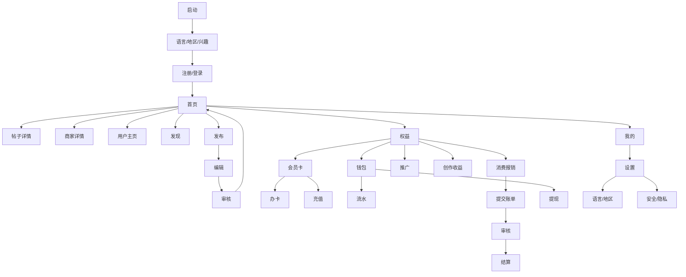

---

# 68. MVP 验收标准

## 社交

- [ ] 新用户 30 秒内完成注册并进入 Feed
- [ ] 可选择 App 语言和内容语言
- [ ] Feed 支持 For You / Following
- [ ] 可发文字、图片、视频
- [ ] 可绑定商家、地点
- [ ] 支持评论、点赞、收藏、分享
- [ ] 支持翻译/查看原文
- [ ] 支持关注
- [ ] 支持举报/屏蔽

## 商家

- [ ] 商家可搜索
- [ ] 商家详情
- [ ] 用户内容聚合
- [ ] 会员优惠展示
- [ ] 门店信息

## 会员卡

- [ ] 会员卡申请
- [ ] 卡状态
- [ ] 激活
- [ ] 冻结
- [ ] 充值
- [ ] 消费明细
- [ ] 卡权益

## 报销

- [ ] 上传凭证
- [ ] OCR
- [ ] 审核
- [ ] 状态
- [ ] 独立结算
- [ ] 结算记录
- [ ] 冻结/冲正

## 钱包

- [ ] 多账户
- [ ] 账务流水
- [ ] 可提现余额
- [ ] 提现
- [ ] 风险控制

## 推广

- [ ] 邀请链接
- [ ] 关系绑定
- [ ] 奖励明细
- [ ] 结算状态
- [ ] 地区/方案可配置

## 国际化

- [ ] 5+ 语言
- [ ] UI 语言独立
- [ ] 内容语言独立
- [ ] 自动翻译
- [ ] 地区化推荐

---

# 69. 建议的产品版本规划

## V0.1 原型验证

目标：验证“社交 + 商家”是否成立。

只做：

```text
注册
→ 兴趣
→ Feed
→ 商家
→ 发布
→ 评论
→ 翻译
```

## V0.5 Beta

加入：

```text
会员卡展示
商家优惠
卡申请
```

## V1.0

加入实际支付/卡能力和经过审查的账户体系。

## V1.5

加入：

```text
消费凭证
审核
会员权益结算
```

## V2.0

加入：

```text
Creator Economy
商家营销
Referral Plan
```

## V2.x

在牌照、合作方、AML、托管和地区合规都准备完成后，开放 USDT/USDC。

---

# 70. 最终产品结构

Taso 不应做成一个“把 Twitter + 银行 + 返利混在一起”的 App。

推荐最终产品模型：

```text
                  TASO
                   │
        ┌──────────┴──────────┐
        │                     │
      SOCIAL               BENEFITS
        │                     │
 ┌──────┼──────┐       ┌──────┼─────────┐
 │      │      │       │      │         │
Feed  Creator  Community Card Wallet  Merchant
 │      │      │       │      │         │
 │      └──┬───┘       │      │         │
 │         │           │      │         │
 └─────────┼───────────┘      │         │
           │                  │         │
           ▼                  ▼         ▼
        消费内容           消费权益     商家生态
           │                  │         │
           └──────────┬───────┴─────────┘
                      ▼
                 Taso Network
```

核心飞轮：

> **用户发现商家 → 去消费 → 分享真实体验 → 产生内容 → 内容带来更多用户 → 用户使用会员卡 → 商户获得消费 → 商户愿意提供更多会员权益 → Taso 内容与商业网络进一步增强。**

这个飞轮比单纯依赖“充值手续费 + 返佣”更稳健，也更利于长期品牌建设。

---

# 71. 产品经理结论

### 第一优先级：先做“内容社交 + 商家”

如果用户打开 App 后 10 秒内感受不到“这里真的有很多值得去的店和地方”，后面的会员卡、钱包和奖励很难产生长期用户价值。

### 第二优先级：会员卡做成权益入口

用户应该因为：

> “这张卡在我常去的地方很有用”

而办卡，而不是因为“可以获得某种收益”而办卡。

### 第三优先级：报销/权益账本必须建立证据链

每一笔权益都能追踪：

```text
谁
→ 在哪里
→ 什么时候
→ 花了多少钱
→ 什么凭证
→ 哪个规则
→ 审核谁
→ 结算多少
→ 什么时候入账
→ 是否提现
```

### 第四优先级：Referral 必须做成规则引擎

不要把“30% / 5% / 1%”写死在客户端。规则必须可以按国家、用户等级、活动周期、商品类型、合规状态动态配置、暂停和审计。

### 第五优先级：USDT / USDC 是独立项目

它不仅是一个“充值方式”，还会把钱包托管、链上转账、AML、Travel Rule/制裁筛查、客户资产安全、兑换/提现、地区限制等问题带入系统。产品上必须独立域设计，技术上也建议隔离账户和权限。

---

# 72. Source / References

1. X Help — “About Post translation.” https://help.x.com/en/using-x/translate-posts
2. X Help — “How to change language settings.” https://help.x.com/en/managing-your-account/how-to-change-language-settings
3. Meta / Threads — “Introducing Threads: A New Way to Share With Text.” https://about.fb.com/news/2023/07/introducing-threads-new-app-text-sharing/
4. Reddit — “How Reddit works / About Reddit.” https://about.reddit.com/
5. Tripadvisor — “Write a review.” https://www.tripadvisor.com/UserReview
6. Visa — “Visa Co-Branded Cards.” https://usa.visa.com/products/cobranded-cards.html
7. Visa — “Visa Partner Types” and Visa Rules / Co-Brand Program requirements. https://partner.visa.com/site/partner-types.html ; Visa Core Rules and Visa Product and Service Rules, Apr 2026. https://rs.visa.com/dam/VCOM/download/about-visa/visa-rules-public.pdf
8. Hong Kong Government / e-Legislation — Pyramid Schemes Prohibition Ordinance (Cap. 617). https://www.elegislation.gov.hk/legoutput?DOC_TYPE=D&FILENAME=%40TOC.pdf&LANGUAGE=ET&LEG_OUTPUT_ID=1260713&PUBLISHED=true ; Hong Kong Government explanation: https://www.info.gov.hk/gia/general/201112/23/P201112230217.htm
9. HKMA — “Digital assets and stablecoins”, Feb 2026. https://www.hkma.gov.hk/media/eng/doc/about-the-hkma/legislative-council-issues/20260202e1.pdf
10. HKMA — “Explanatory Note on Licensing of Stablecoin Issuers.” https://www.hkma.gov.hk/media/eng/doc/key-functions/ifc/stablecoin-issuers/Explanatory_Notes_on_Licensing_of_Stablecoin_Issuers_eng.pdf
11. SFC — “Circular on provision of Relevant Stablecoin service by virtual asset trading platforms and licensed corporations”, 27 May 2026. https://apps.sfc.hk/edistributionWeb/api/circular/list-content/circular/doc?lang=TC&refNo=26EC26
12. HKMA — “Explanatory Note on Licensing for Stored Value Facilities.” https://www.hkma.gov.hk/media/eng/doc/key-functions/financial-infrastructure/infrastructure/retail-payment-initiatives/Explanatory_note_on_licensing_for_SVF.pdf
13. HKMA — “International Financial Centre / Stored Value Facilities” Annual Report 2025. https://www.hkma.gov.hk/media/eng/publication-and-research/annual-report/2025/16_International_Financial_Centre.pdf

---

## 附：本 PRD 的实施优先级摘要

```text
P0 = 必须上线
P1 = V1.1 / V1.5
P2 = 中长期

P0 Social
├── Feed
├── Posting
├── Comment
├── Follow
├── Search
├── Merchant
├── Translation
└── Safety

P0 Membership
├── Card
├── Merchant Offers
├── Wallet
├── Transaction
└── Topup（在支付合作方准备好后）

P1 Consumer Benefit
├── Receipt Upload
├── OCR
├── Review
├── Settlement Ledger
└── Withdrawal

P1 Creator
├── Creator Center
├── Analytics
└── Reward

P2 Growth
├── Referral Engine
├── Merchant Ads
└── Campaigns

P2 Digital Assets
├── USDT
├── USDC
├── Chain Selection
├── Screening
└── Crypto Withdrawal
```

**建议的产品核心 KPI：**

```text
内容侧：
DAU / WAU
Feed 深度
内容发布率
D7 留存
关注率
商家点击率
收藏率
翻译使用率

消费侧：
有效会员数
会员卡激活率
月活会员消费人数
会员商家覆盖数
会员优惠使用率
人均消费

内容商业侧：
Verified Purchase 内容占比
商家带来的内容量
Creator 活跃率
Creator 收益覆盖率

风控侧：
凭证通过率
重复凭证率
异常交易率
提现拒绝率
人工审核率
资金对账差异率
```
